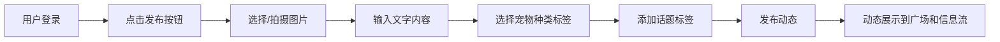
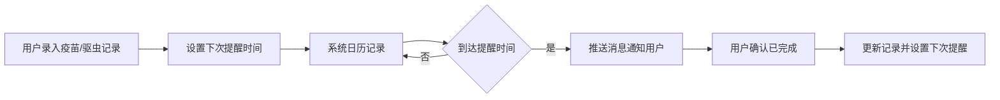
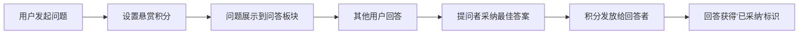

## 1. 产品概述

"萌宠乐园"是一个集宠物社交、内容分享、健康管理、生活服务于一体的综合宠物社区平台。为宠物主人打造一个分享爱宠日常、交流养宠经验、管理宠物健康的温暖家园。

- 核心价值：连接千万宠物主人，让养宠更快乐、更科学
- 目标用户：宠物主人、兽医专业人士、宠物爱好者
- 解决痛点：养宠经验分散、宠物健康管理混乱、同城宠物服务信息不对称

## 2. 核心 Features

### 2.1 用户角色

| 角色 | 注册方式 | 核心权限 |
|------|----------|----------|
| 普通用户 | 手机号/邮箱注册 | 发布内容、创建宠物档案、互动评论、健康记录、浏览同城信息 |
| 兽医认证用户 | 普通注册 + 资质审核 | 问答板块专业回答标识、积分加成、优先展示 |
| 平台管理员 | 后台邀请 | 内容审核、用户管理、场所审核、数据统计 |

### 2.2 功能模块

1. **用户系统**：注册登录、个人主页、关注/粉丝、积分系统
2. **宠物档案**：创建/编辑宠物信息、成长相册时间线、多宠物管理
3. **动态广场**：图文发布、点赞、评论、转发、话题标签
4. **内容浏览**：按宠物种类分类、热门话题、推荐算法
5. **养宠问答**：发起问题、专业回答、采纳机制、积分奖励
6. **健康记录**：体重记录、疫苗接种、驱虫提醒、健康日历
7. **同城服务**：宠物寄养、宠物医院、友好场所、评价打分
8. **消息通知**：互动提醒、健康提醒、系统通知

### 2.3 页面详情

| 页面名称 | 模块名称 | 功能描述 |
|----------|----------|----------|
| 首页/信息流 | 动态列表 | 展示关注用户动态，支持下拉刷新、无限滚动 |
| 首页/信息流 | 顶部导航 | 分类快捷入口（猫/狗/鸟/爬宠等）、搜索框 |
| 动态广场 | 内容流 | 按时间/热度排序的所有用户动态 |
| 动态广场 | 标签筛选 | 宠物种类标签、热门话题标签 |
| 动态详情 | 内容展示 | 图文内容、发布者信息、互动数据 |
| 动态详情 | 评论区 | 评论列表、回复、点赞、举报 |
| 发布动态 | 内容编辑 | 图片上传、文字编辑、标签选择 |
| 宠物档案 | 宠物列表 | 用户所有宠物的卡片列表 |
| 宠物档案 | 宠物详情 | 基本信息、成长相册时间线、健康记录入口 |
| 创建/编辑宠物 | 表单 | 品种选择、性别、生日、头像上传、简介 |
| 养宠问答 | 问题列表 | 热门问题、最新问题、分类筛选 |
| 养宠问答 | 问题详情 | 问题描述、回答列表、采纳标识 |
| 养宠问答 | 发起问题 | 标题、详情、分类选择、悬赏积分 |
| 健康记录 | 概览 | 最近疫苗/驱虫提醒、体重趋势图 |
| 健康记录 | 疫苗驱虫 | 接种记录、下次提醒设置 |
| 健康记录 | 体重记录 | 数据录入、趋势图表 |
| 同城板块 | 场所列表 | 寄养、医院、友好场所分类，地图模式 |
| 同城板块 | 场所详情 | 基本信息、用户评价、营业时间、联系方式 |
| 同城板块 | 提交场所 | 名称、类型、地址、照片、简介 |
| 个人中心 | 用户信息 | 头像、昵称、简介、积分、关注数、粉丝数 |
| 个人中心 | 我的宠物 | 宠物档案入口 |
| 个人中心 | 我的内容 | 我发布的动态、我的提问、我的回答 |
| 个人中心 | 设置 | 账号设置、通知设置、隐私设置 |
| 登录注册 | 表单 | 手机号/邮箱、验证码、密码 |

## 3. 核心流程

### 3.1 用户发布动态流程

### 3.2 健康提醒流程

### 3.3 问答积分奖励流程

## 4. 用户界面设计

### 4.1 设计风格

**整体风格**：温暖治愈、活泼可爱、简洁易用

- **主色调**：暖橙色 `#FF8A65`（代表活力和温暖）+ 薄荷绿 `#81C784`（代表健康和自然）
- **辅助色**：奶油粉 `#F8BBD0`、天空蓝 `#81D4FA`、柠檬黄 `#FFE082`
- **中性色**：米白 `#FFFCF8`、暖灰 `#757575`、深棕 `#5D4037`
- **按钮风格**：圆角矩形（16px）、柔和渐变、轻微悬浮动效
- **字体**：
  - 标题：圆润可爱的 display 字体
  - 正文：清晰易读的无衬线字体
- **图标风格**：圆角线性图标、柔和填充色
- **卡片风格**：圆角（20px）、柔和阴影、浅色背景

### 4.2 页面设计概述

| 页面名称 | 模块名称 | UI 元素 |
|----------|----------|---------|
| 首页信息流 | 动态卡片 | 圆角卡片、用户头像、宠物标签、图文混排、互动按钮（点赞/评论/转发）、悬停放大动效 |
| 动态广场 | 标签导航 | 横向滚动标签栏、选中态高亮、渐变背景 |
| 宠物档案 | 时间线 | 垂直时间线、圆点标记、照片卡片、渐显动画 |
| 健康记录 | 数据卡片 | 彩色进度环、体重趋势折线图、倒计时提醒卡片 |
| 同城板块 | 地图卡片 | 地图标记点悬浮、场所列表卡片、评分星级显示 |
| 养宠问答 | 问题卡片 | 标题高亮、悬赏积分徽章、回答数量标识、采纳状态 |

### 4.3 响应式设计

- **设计原则**：桌面端优先，移动端自适应
- **断点设置**：
  - 桌面端：≥1200px，三栏布局（左侧导航 + 主内容 + 右侧推荐）
  - 平板端：768px-1199px，双栏布局（导航 + 主内容）
  - 移动端：<768px，单栏布局，底部Tab导航
- **触摸优化**：按钮最小尺寸 44x44px，滑动手势支持，双击点赞

### 4.4 交互动效

- **页面加载**：骨架屏加载，内容渐入动画
- **卡片交互**：悬停轻微上浮 + 阴影加深
- **点赞动效**：心形图标弹跳缩放 + 颜色填充动画
- **时间线滚动**：元素随滚动渐显出现
- **模态框**：底部滑入 + 背景模糊
- **标签切换**：平滑过渡 + 下划线滑动
