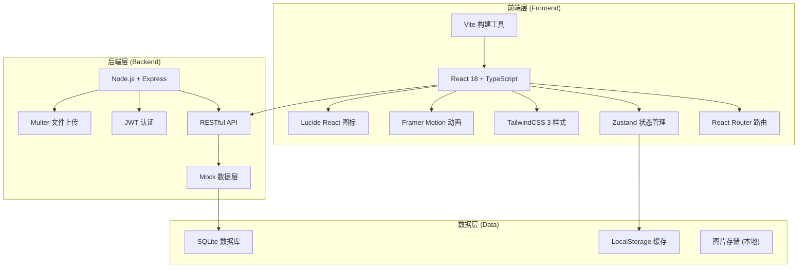
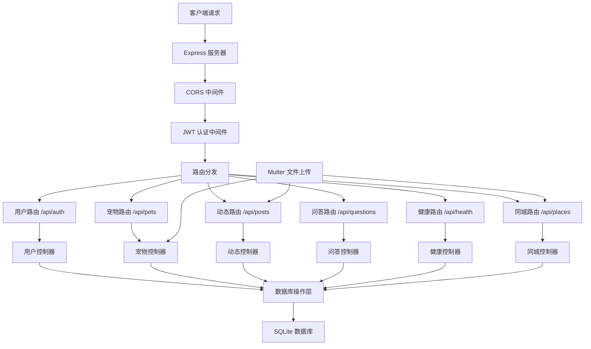
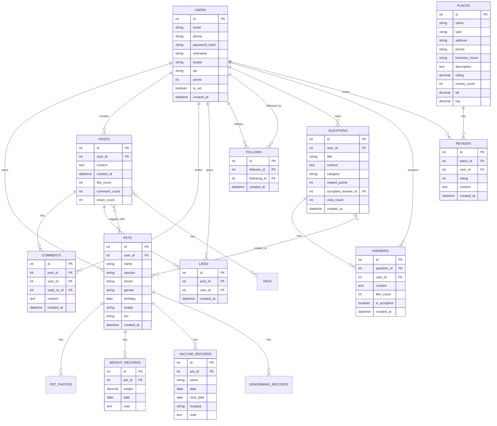

## 1. 架构设计



## 2. 技术选型说明

### 2.1 前端技术栈
- **框架**：React@18.2.0 + TypeScript@5.4.0 - 类型安全，组件化开发
- **构建工具**：Vite@5.2.0 - 快速度开发体验，热更新
- **路由**：react-router-dom@6.22.0 - 声明式路由管理
- **状态管理**：zustand@4.5.0 - 轻量级状态管理，简单易用
- **样式**：tailwindcss@3.4.0 + postcss + autoprefixer - 原子化CSS
- **动画**：framer-motion@11.0.0 - 流畅的动画效果
- **图标**：lucide-react@0.344.0 - 统一风格的图标库
- **图表**：recharts@2.12.0 - 体重趋势图表
- **图片上传**：react-dropzone@14.2.0 - 拖拽上传组件

### 2.2 后端技术栈
- **运行时**：Node.js@20.10.0
- **框架**：Express@4.18.0 - 轻量级Web框架
- **认证**：jsonwebtoken@9.0.0 - JWT身份验证
- **文件上传**：multer@1.4.5 - 图片上传处理
- **数据库**：better-sqlite3@9.4.0 - 轻量级SQLite数据库
- **ORM**：基于原生SQL，使用参数化查询

### 2.3 数据存储方案
- 使用 SQLite 作为主数据库，存储用户、宠物、动态、评论等核心数据
- 使用 LocalStorage 缓存用户登录状态、主题偏好等
- 图片存储在本地 `uploads/` 目录下，通过静态资源服务访问
- 开发阶段提供完整的 Mock 数据，无需依赖外部服务

## 3. 目录结构

```
pet-community/
├── client/                 # 前端项目
│   ├── src/
│   │   ├── components/     # 公共组件
│   │   ├── pages/          # 页面组件
│   │   ├── store/          # Zustand 状态管理
│   │   ├── api/            # API 接口封装
│   │   ├── types/          # TypeScript 类型定义
│   │   ├── utils/          # 工具函数
│   │   ├── hooks/          # 自定义 Hooks
│   │   ├── assets/         # 静态资源
│   │   ├── App.tsx
│   │   ├── main.tsx
│   │   └── index.css
│   ├── package.json
│   ├── vite.config.ts
│   └── tailwind.config.js
├── server/                 # 后端项目
│   ├── src/
│   │   ├── routes/         # 路由定义
│   │   ├── controllers/    # 控制器
│   │   ├── middleware/     # 中间件
│   │   ├── db/             # 数据库操作
│   │   ├── types/          # 类型定义
│   │   ├── utils/          # 工具函数
│   │   └── index.ts
│   ├── uploads/            # 图片上传目录
│   ├── package.json
│   └── tsconfig.json
├── package.json            # 根 package.json (concurrently)
└── README.md
```

## 4. 路由定义

### 4.1 前端路由

| 路由路径 | 页面名称 | 权限 |
|---------|---------|------|
| `/` | 首页信息流 | 公开 |
| `/square` | 动态广场 | 公开 |
| `/square/:postId` | 动态详情 | 公开 |
| `/pets` | 宠物列表 | 需要登录 |
| `/pets/:petId` | 宠物详情 | 需要登录 |
| `/pets/create` | 创建宠物 | 需要登录 |
| `/qa` | 养宠问答 | 公开 |
| `/qa/:questionId` | 问题详情 | 公开 |
| `/qa/ask` | 发起问题 | 需要登录 |
| `/health` | 健康记录 | 需要登录 |
| `/nearby` | 同城板块 | 公开 |
| `/nearby/:placeId` | 场所详情 | 公开 |
| `/nearby/submit` | 提交场所 | 需要登录 |
| `/profile` | 个人中心 | 需要登录 |
| `/profile/:userId` | 用户主页 | 公开 |
| `/login` | 登录 | 公开 |
| `/register` | 注册 | 公开 |

### 4.2 API 接口定义

#### 用户模块
```typescript
// POST /api/auth/register
interface RegisterRequest {
  email: string;
  phone: string;
  password: string;
  nickname: string;
}

// POST /api/auth/login
interface LoginRequest {
  email: string;
  password: string;
}

interface AuthResponse {
  token: string;
  user: {
    id: number;
    nickname: string;
    avatar: string;
    points: number;
    isVet: boolean;
  };
}

// GET /api/users/:userId
interface UserProfile {
  id: number;
  nickname: string;
  avatar: string;
  bio: string;
  points: number;
  isVet: boolean;
  followingCount: number;
  followerCount: number;
  postCount: number;
  pets: Pet[];
}

// POST /api/users/:userId/follow
// DELETE /api/users/:userId/follow
```

#### 宠物模块
```typescript
// POST /api/pets
interface CreatePetRequest {
  name: string;
  species: 'cat' | 'dog' | 'bird' | 'reptile' | 'other';
  breed: string;
  gender: 'male' | 'female';
  birthday: string;
  avatar: string;
  bio: string;
}

// GET /api/pets
// GET /api/pets/:petId
// PUT /api/pets/:petId
// DELETE /api/pets/:petId

interface Pet {
  id: number;
  userId: number;
  name: string;
  species: string;
  breed: string;
  gender: string;
  birthday: string;
  avatar: string;
  bio: string;
  age: number;
  photos: PetPhoto[];
}

// POST /api/pets/:petId/photos
interface AddPhotoRequest {
  image: string;
  caption: string;
  date: string;
}

interface PetPhoto {
  id: number;
  image: string;
  caption: string;
  date: string;
  createdAt: string;
}
```

#### 动态模块
```typescript
// GET /api/posts
// POST /api/posts
interface CreatePostRequest {
  content: string;
  images: string[];
  petIds: number[];
  tags: string[];
}

interface Post {
  id: number;
  user: {
    id: number;
    nickname: string;
    avatar: string;
  };
  content: string;
  images: string[];
  tags: string[];
  pets: Pet[];
  likeCount: number;
  commentCount: number;
  shareCount: number;
  isLiked: boolean;
  createdAt: string;
}

// POST /api/posts/:postId/like
// DELETE /api/posts/:postId/like

// GET /api/posts/:postId/comments
// POST /api/posts/:postId/comments
interface CreateCommentRequest {
  content: string;
  replyToId?: number;
}

// POST /api/posts/:postId/share
```

#### 问答模块
```typescript
// GET /api/questions
// POST /api/questions
interface CreateQuestionRequest {
  title: string;
  content: string;
  category: string;
  rewardPoints: number;
  petIds: number[];
}

interface Question {
  id: number;
  user: User;
  title: string;
  content: string;
  category: string;
  rewardPoints: number;
  viewCount: number;
  answerCount: number;
  isAnswered: boolean;
  acceptedAnswerId: number | null;
  createdAt: string;
  answers: Answer[];
}

// POST /api/questions/:questionId/answers
interface CreateAnswerRequest {
  content: string;
}

interface Answer {
  id: number;
  user: User;
  content: string;
  isAccepted: boolean;
  likeCount: number;
  createdAt: string;
}

// POST /api/questions/:questionId/answers/:answerId/accept
```

#### 健康记录模块
```typescript
// GET /api/health/records
// POST /api/health/weight
interface WeightRecord {
  id: number;
  petId: number;
  weight: number;
  date: string;
  note: string;
}

// GET /api/health/vaccines
// POST /api/health/vaccines
interface VaccineRecord {
  id: number;
  petId: number;
  name: string;
  date: string;
  nextDate: string;
  hospital: string;
  note: string;
}

// GET /api/health/deworming
// POST /api/health/deworming
interface DewormingRecord {
  id: number;
  petId: number;
  type: 'internal' | 'external';
  date: string;
  nextDate: string;
  product: string;
  note: string;
}

// GET /api/health/reminders
```

#### 同城模块
```typescript
// GET /api/places
// GET /api/places/:placeId
interface Place {
  id: number;
  name: string;
  type: 'boarding' | 'hospital' | 'friendly';
  address: string;
  phone: string;
  businessHours: string;
  images: string[];
  description: string;
  rating: number;
  reviewCount: number;
  lat: number;
  lng: number;
}

// POST /api/places
// POST /api/places/:placeId/reviews
interface CreateReviewRequest {
  rating: number;
  content: string;
  images: string[];
}

interface Review {
  id: number;
  user: User;
  rating: number;
  content: string;
  images: string[];
  createdAt: string;
}
```

## 5. 服务器架构



## 6. 数据模型

### 6.1 ER 图



### 6.2 DDL 语句

```sql
-- 用户表
CREATE TABLE users (
  id INTEGER PRIMARY KEY AUTOINCREMENT,
  email VARCHAR(100) UNIQUE NOT NULL,
  phone VARCHAR(20) UNIQUE,
  password_hash VARCHAR(255) NOT NULL,
  nickname VARCHAR(50) NOT NULL,
  avatar VARCHAR(255),
  bio TEXT,
  points INTEGER DEFAULT 100,
  is_vet BOOLEAN DEFAULT 0,
  created_at DATETIME DEFAULT CURRENT_TIMESTAMP
);

-- 宠物表
CREATE TABLE pets (
  id INTEGER PRIMARY KEY AUTOINCREMENT,
  user_id INTEGER NOT NULL,
  name VARCHAR(50) NOT NULL,
  species VARCHAR(20) NOT NULL,
  breed VARCHAR(50),
  gender VARCHAR(10),
  birthday DATE,
  avatar VARCHAR(255),
  bio TEXT,
  created_at DATETIME DEFAULT CURRENT_TIMESTAMP,
  FOREIGN KEY (user_id) REFERENCES users(id)
);

-- 宠物照片表（成长相册）
CREATE TABLE pet_photos (
  id INTEGER PRIMARY KEY AUTOINCREMENT,
  pet_id INTEGER NOT NULL,
  image VARCHAR(255) NOT NULL,
  caption TEXT,
  date DATE NOT NULL,
  created_at DATETIME DEFAULT CURRENT_TIMESTAMP,
  FOREIGN KEY (pet_id) REFERENCES pets(id)
);

-- 动态表
CREATE TABLE posts (
  id INTEGER PRIMARY KEY AUTOINCREMENT,
  user_id INTEGER NOT NULL,
  content TEXT NOT NULL,
  created_at DATETIME DEFAULT CURRENT_TIMESTAMP,
  like_count INTEGER DEFAULT 0,
  comment_count INTEGER DEFAULT 0,
  share_count INTEGER DEFAULT 0,
  FOREIGN KEY (user_id) REFERENCES users(id)
);

-- 动态图片表
CREATE TABLE post_images (
  id INTEGER PRIMARY KEY AUTOINCREMENT,
  post_id INTEGER NOT NULL,
  image VARCHAR(255) NOT NULL,
  sort_order INTEGER DEFAULT 0,
  FOREIGN KEY (post_id) REFERENCES posts(id)
);

-- 动态标签关联表
CREATE TABLE post_tags (
  id INTEGER PRIMARY KEY AUTOINCREMENT,
  post_id INTEGER NOT NULL,
  tag VARCHAR(50) NOT NULL,
  FOREIGN KEY (post_id) REFERENCES posts(id)
);

-- 动态宠物关联表
CREATE TABLE post_pets (
  id INTEGER PRIMARY KEY AUTOINCREMENT,
  post_id INTEGER NOT NULL,
  pet_id INTEGER NOT NULL,
  FOREIGN KEY (post_id) REFERENCES posts(id),
  FOREIGN KEY (pet_id) REFERENCES pets(id)
);

-- 点赞表
CREATE TABLE likes (
  id INTEGER PRIMARY KEY AUTOINCREMENT,
  post_id INTEGER NOT NULL,
  user_id INTEGER NOT NULL,
  created_at DATETIME DEFAULT CURRENT_TIMESTAMP,
  FOREIGN KEY (post_id) REFERENCES posts(id),
  FOREIGN KEY (user_id) REFERENCES users(id),
  UNIQUE(post_id, user_id)
);

-- 评论表
CREATE TABLE comments (
  id INTEGER PRIMARY KEY AUTOINCREMENT,
  post_id INTEGER NOT NULL,
  user_id INTEGER NOT NULL,
  reply_to_id INTEGER,
  content TEXT NOT NULL,
  created_at DATETIME DEFAULT CURRENT_TIMESTAMP,
  FOREIGN KEY (post_id) REFERENCES posts(id),
  FOREIGN KEY (user_id) REFERENCES users(id),
  FOREIGN KEY (reply_to_id) REFERENCES comments(id)
);

-- 关注关系表
CREATE TABLE follows (
  id INTEGER PRIMARY KEY AUTOINCREMENT,
  follower_id INTEGER NOT NULL,
  following_id INTEGER NOT NULL,
  created_at DATETIME DEFAULT CURRENT_TIMESTAMP,
  FOREIGN KEY (follower_id) REFERENCES users(id),
  FOREIGN KEY (following_id) REFERENCES users(id),
  UNIQUE(follower_id, following_id)
);

-- 问题表
CREATE TABLE questions (
  id INTEGER PRIMARY KEY AUTOINCREMENT,
  user_id INTEGER NOT NULL,
  title VARCHAR(200) NOT NULL,
  content TEXT NOT NULL,
  category VARCHAR(50) NOT NULL,
  reward_points INTEGER DEFAULT 0,
  accepted_answer_id INTEGER,
  view_count INTEGER DEFAULT 0,
  created_at DATETIME DEFAULT CURRENT_TIMESTAMP,
  FOREIGN KEY (user_id) REFERENCES users(id)
);

-- 回答表
CREATE TABLE answers (
  id INTEGER PRIMARY KEY AUTOINCREMENT,
  question_id INTEGER NOT NULL,
  user_id INTEGER NOT NULL,
  content TEXT NOT NULL,
  is_accepted BOOLEAN DEFAULT 0,
  like_count INTEGER DEFAULT 0,
  created_at DATETIME DEFAULT CURRENT_TIMESTAMP,
  FOREIGN KEY (question_id) REFERENCES questions(id),
  FOREIGN KEY (user_id) REFERENCES users(id)
);

-- 体重记录表
CREATE TABLE weight_records (
  id INTEGER PRIMARY KEY AUTOINCREMENT,
  pet_id INTEGER NOT NULL,
  weight DECIMAL(5,2) NOT NULL,
  date DATE NOT NULL,
  note TEXT,
  created_at DATETIME DEFAULT CURRENT_TIMESTAMP,
  FOREIGN KEY (pet_id) REFERENCES pets(id)
);

-- 疫苗记录表
CREATE TABLE vaccine_records (
  id INTEGER PRIMARY KEY AUTOINCREMENT,
  pet_id INTEGER NOT NULL,
  name VARCHAR(100) NOT NULL,
  date DATE NOT NULL,
  next_date DATE,
  hospital VARCHAR(100),
  note TEXT,
  created_at DATETIME DEFAULT CURRENT_TIMESTAMP,
  FOREIGN KEY (pet_id) REFERENCES pets(id)
);

-- 驱虫记录表
CREATE TABLE deworming_records (
  id INTEGER PRIMARY KEY AUTOINCREMENT,
  pet_id INTEGER NOT NULL,
  type VARCHAR(20) NOT NULL,
  date DATE NOT NULL,
  next_date DATE,
  product VARCHAR(100),
  note TEXT,
  created_at DATETIME DEFAULT CURRENT_TIMESTAMP,
  FOREIGN KEY (pet_id) REFERENCES pets(id)
);

-- 场所表
CREATE TABLE places (
  id INTEGER PRIMARY KEY AUTOINCREMENT,
  name VARCHAR(100) NOT NULL,
  type VARCHAR(20) NOT NULL,
  address VARCHAR(255) NOT NULL,
  phone VARCHAR(20),
  business_hours VARCHAR(255),
  description TEXT,
  rating DECIMAL(2,1) DEFAULT 0,
  review_count INTEGER DEFAULT 0,
  lat DECIMAL(10,6),
  lng DECIMAL(10,6),
  created_by INTEGER,
  is_approved BOOLEAN DEFAULT 1,
  created_at DATETIME DEFAULT CURRENT_TIMESTAMP,
  FOREIGN KEY (created_by) REFERENCES users(id)
);

-- 场所图片表
CREATE TABLE place_images (
  id INTEGER PRIMARY KEY AUTOINCREMENT,
  place_id INTEGER NOT NULL,
  image VARCHAR(255) NOT NULL,
  FOREIGN KEY (place_id) REFERENCES places(id)
);

-- 评价表
CREATE TABLE reviews (
  id INTEGER PRIMARY KEY AUTOINCREMENT,
  place_id INTEGER NOT NULL,
  user_id INTEGER NOT NULL,
  rating INTEGER NOT NULL,
  content TEXT,
  created_at DATETIME DEFAULT CURRENT_TIMESTAMP,
  FOREIGN KEY (place_id) REFERENCES places(id),
  FOREIGN KEY (user_id) REFERENCES users(id),
  UNIQUE(place_id, user_id)
);

-- 评价图片表
CREATE TABLE review_images (
  id INTEGER PRIMARY KEY AUTOINCREMENT,
  review_id INTEGER NOT NULL,
  image VARCHAR(255) NOT NULL,
  FOREIGN KEY (review_id) REFERENCES reviews(id)
);
```

### 6.3 初始化 Mock 数据

```sql
-- 初始化测试用户
INSERT INTO users (email, phone, password_hash, nickname, avatar, bio, points, is_vet) VALUES
('demo@pet.com', '13800138000', '$2b$10$...', '爱猫人士', '/avatars/user1.jpg', '家里有三只猫主子', 520, 0),
('vet@pet.com', '13900139000', '$2b$10$...', '李兽医', '/avatars/vet.jpg', '执业兽医，从业10年', 1280, 1),
('doglover@pet.com', '13700137000', '$2b$10$...', '铲屎官小王', '/avatars/user2.jpg', '金毛和柯基的铲屎官', 360, 0);

-- 初始化宠物
INSERT INTO pets (user_id, name, species, breed, gender, birthday, avatar, bio) VALUES
(1, '橘子', 'cat', '英国短毛猫', 'male', '2022-03-15', '/pets/cat1.jpg', '爱吃小鱼干的胖橘'),
(1, '奶茶', 'cat', '布偶猫', 'female', '2023-01-20', '/pets/cat2.jpg', '蓝眼睛的小公主'),
(2, '豆豆', 'dog', '金毛寻回犬', 'male', '2021-06-10', '/pets/dog1.jpg', '阳光大男孩');

-- 初始化场所
INSERT INTO places (name, type, address, phone, business_hours, description, rating, review_count, lat, lng) VALUES
('萌宠乐园宠物医院', 'hospital', '北京市朝阳区建国路88号', '010-12345678', '周一至周日 09:00-21:00', '专业宠物医院，24小时急诊', 4.8, 156, 39.9042, 116.4074),
('爱心宠物寄养中心', 'boarding', '北京市海淀区中关村大街1号', '010-87654321', '周一至周日 08:00-20:00', '家庭式寄养，专人照顾', 4.9, 89, 39.9842, 116.3074),
('宠物友好咖啡馆', 'friendly', '北京市西城区西单北大街100号', '010-55667788', '周一至周日 10:00-22:00', '欢迎携带宠物入内，提供宠物专属零食', 4.7, 234, 39.9142, 116.3674);
```
